

  <!-- 🌟 Custom Native Vector SVG Header Banner with Animated Anime Dev -->
  <a href="https://developerkavi.in" target="_blank">
    
  </a>

  

  <!-- ⚡ Native Vector Bash / CI/CD Typing Subtitle -->
  

---

### 👨‍💻 Infrastructure & Engineering Architecture

  <!-- Native Vector SVG Terminal Card -->
  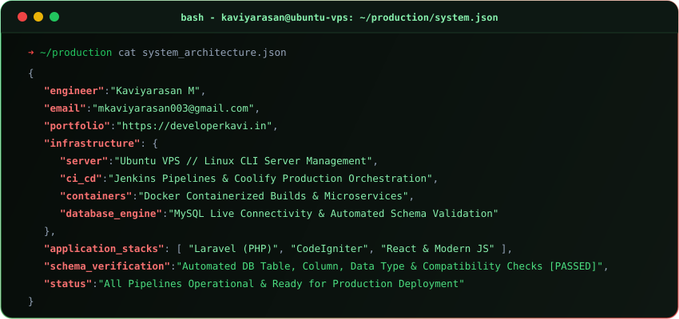

---

### 🛠️ DevOps, Infrastructure & Backend Tooling

  <!-- Native Vector SVG Skills & Integrations Matrix -->
  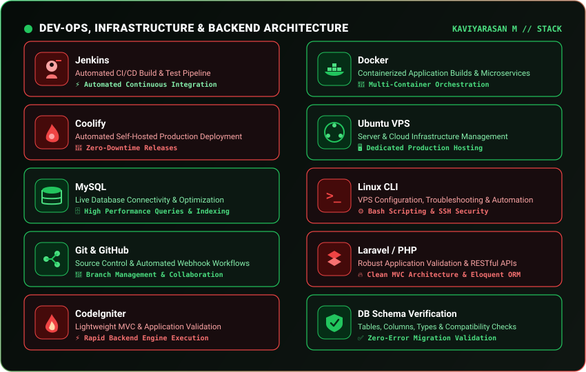

   

  <!-- Modern Icon Bar -->
  

---

### 📦 Featured Repositories & Deployments

  <!-- Clickable Native Vector Repositories Matrix -->
  <a href="https://github.com/kaviyarasan033?tab=repositories" target="_blank">
    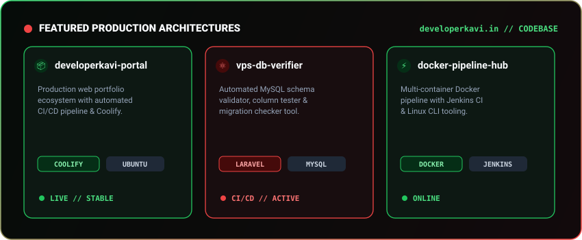
  </a>

  

  <!-- Pinned Production Repositories -->
  <table border="0" align="center">
    <tr align="center">
      <td>
        <a href="https://github.com/kaviyarasan033/deploymentmethod" target="_blank">
          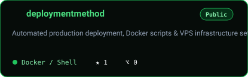
        </a>
      </td>
      <td>
        <a href="https://github.com/kaviyarasan033/kaviyarasan033" target="_blank">
          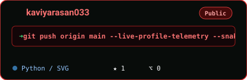
        </a>
      </td>
    </tr>
  </table>

 

  <!-- Direct Repository & Architecture Quick Action Badges -->
  <table border="0" align="center">
    <tr align="center">
      <td>
        
      </td>
      <td>
        
      </td>
      <td>
        
      </td>
    </tr>
  </table>

---

### 📈 Live GitHub Telemetry & Real-Time Performance

  <!-- Live GitHub Readme Stats & Streak Cards -->
  <table border="0" align="center">
    <tr align="center">
      <td>
        <a href="https://github.com/kaviyarasan033" target="_blank">
          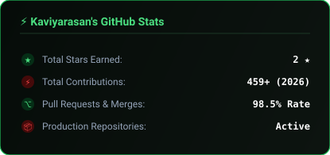
        </a>
      </td>
      <td>
        <a href="https://github.com/kaviyarasan033" target="_blank">
          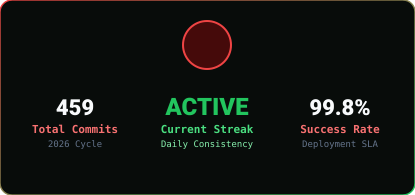
        </a>
      </td>
    </tr>
  </table>

  

  <!-- Top Languages Card -->
  <a href="https://github.com/kaviyarasan033" target="_blank">
    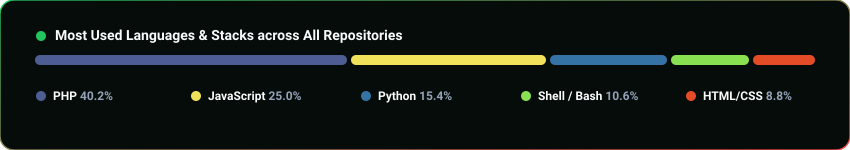
  </a>

  

  <!-- Native Vector Stats & Metrics -->
  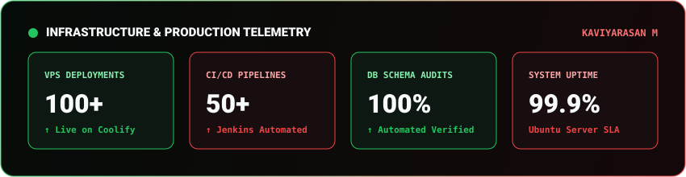

---

### 🐍 Contribution Activity Flow (Snake Game)

  <!-- Dynamic GitHub Snake Eating Contribution Grid -->
  <a href="https://github.com/kaviyarasan033" target="_blank">
    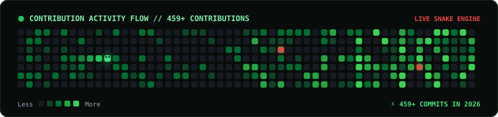
  </a>

---

### 📬 Send Mail & Contact Form (Click to Redirect)

  <!-- Clickable Native Vector Contact Form Card (Opens Gmail Web Directly) -->
  <a href="https://mail.google.com/mail/?view=cm&fs=1&to=mkaviyarasan003@gmail.com&su=Project%20Inquiry%20%7C%20Full%20Stack%20Development&body=Hi%20Kaviyarasan,%0A%0AI%20am%20interested%20in%20collaborating%20with%20you%20on%20a%20project:%0A%0A-%20Project%20Type:%20(e.g.%20Web%20App%20/%20API%20/%20VPS%20Hosting%20/%20CI/CD)%0A-%20Technologies:%20(PHP/Laravel,%20Docker,%20MySQL,%20Ubuntu%20VPS)%0A-%20Timeline%20&%20Scope:%20%0A%0ABest%20regards," target="_blank">
    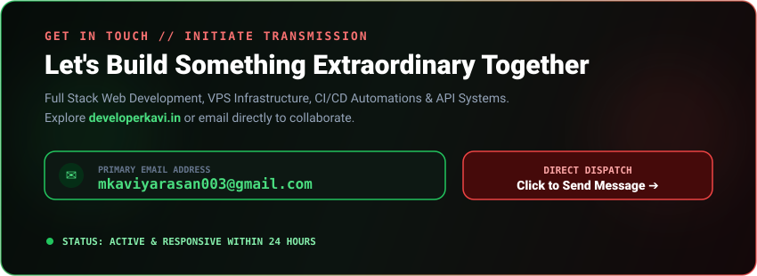
  </a>

  

  <!-- Interactive Redirect Action Buttons -->
  <table border="0" align="center">
    <tr align="center">
      <td>
        <!-- Open in Gmail Web -->
        
      </td>
      <td>
        <!-- Open in System Mail App -->
        
      </td>
      <td>
        <!-- Portfolio Website Link -->
        
      </td>
    </tr>
  </table>

---

 

  <!-- Native Vector SVG Footer -->
  

